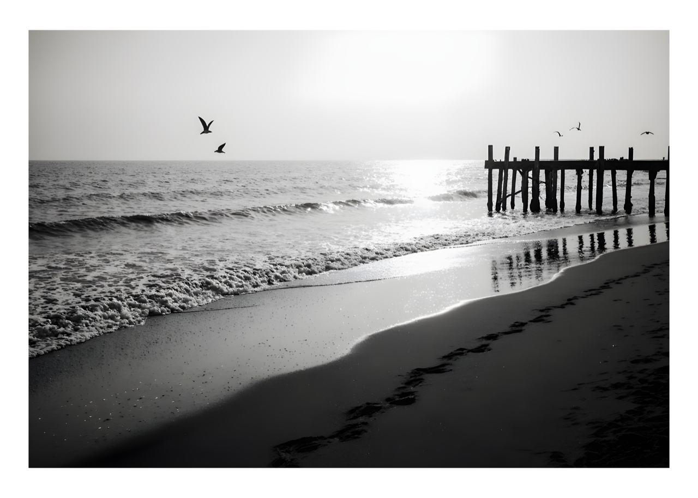

## Solitude 

> The tide rolls in slow, like a man who’s seen too much and doesn’t need to say it. The pier stands half-lost in the light, its bones worn but still holding—like a man who’s been broken and doesn’t flinch. Sand holds the weight of footsteps, but no one walks here anymore. Just the gulls, flying in silence, like thoughts that don’t need words. This is what peace sounds like when it’s earned.
>
> #ArtNoir #FilmNoir #BlackAndWhiteMood #QuietConfidence #SolemnBeauty

### Model
- Flux.1 Krea [dev]

### Settings
- Steps: 32
- Text Guidance: 2.5
- Upscaler: Real-ESGRAN 4x
- Sampler: DPM++ 2M AYS

### Prompt

> A vast stretch of coastline in black and white, where the horizon dissolves into a haze of light. The sea is calm but restless, a slow, deliberate breathing. Waves roll in and break gently against the dark, glistening sand, leaving behind thin veins of foam that shimmer for a moment before fading back into the tide. A line of footprints leads from the dunes to the water’s edge, then vanishes where the surf erases all memory. Farther down the beach, an old wooden pier extends into the mist, its beams weathered, its reflection trembling in the shallow pools left by the retreating tide. Seagulls drift low, their cries faint and fleeting, swallowed by the wind. The air carries a quiet chill, heavy with salt and nostalgia. The sun, though unseen, presses softly against the horizon, casting long, pale gradients across the ocean’s skin. Everything feels still, not empty, but complete in its solitude. The world reduced to contrasts: water and sand, light and shadow, movement and memory. A moment that feels like silence made visible.

---

