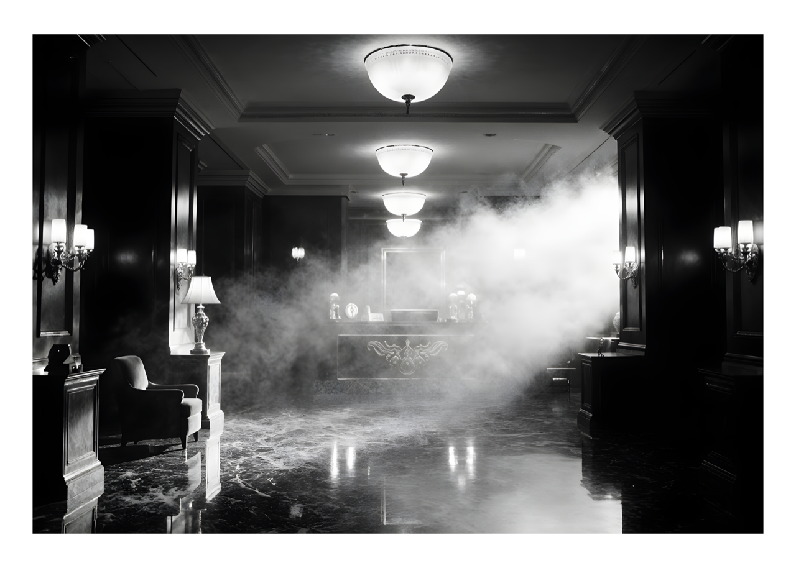

## Vanished 

---

> The lobby’s empty now, just like it always was at 3 AM. The marble floor drinks the light from those old glass globes, turns it into something cold and sharp. Fog rolls in slow, thick as smoke from a long-dead fire, swallowing the chairs and the desk. No one’s here. Just silence and shadows stretching long across the floor, like ghosts waiting for a door to open.
>
> #ArtNoir #FilmNoir #BlackAndWhite #MoodyPhotography #UrbanExploration

### Model
- Flux.1 Krea [dev]

### Settings
- Steps: 32
- Text Guidance: 2.5
- Upscaler: Real-ESGRAN 4x
- Sampler: DPM++ 2M AYS

### Prompt

> elegant hotel lobby at night in black and white, art-deco furniture and marble floor gleaming under ceiling lamps, faint haze of smoke drifting through light beams, empty reception desk, symmetrical composition from a low centered camera, deep focus and glossy reflections, cinematic lighting in silver-gelatin style with subtle film grain, aura of authority, tension, seduction, power and beauty in absence
